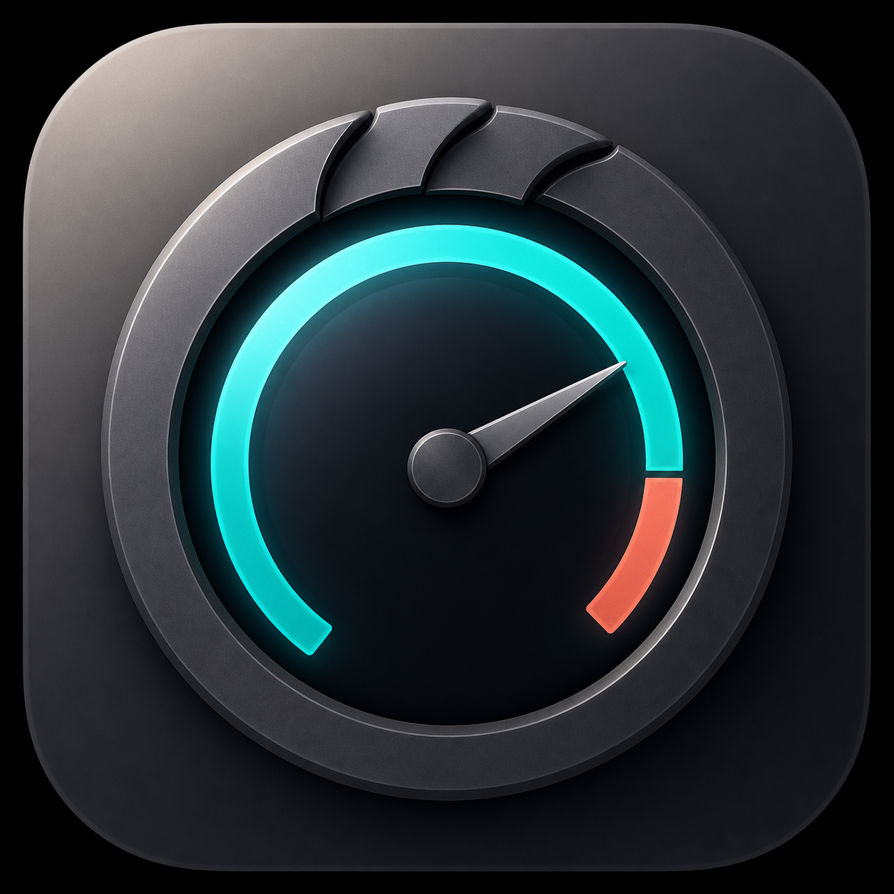

# Clawstatus for macOS



Clawstatus is a small native macOS menu-bar monitor for Claude Code and Codex usage limits.
It is built with SwiftUI, uses no third-party dependencies, and does not use a
browser or webview.

## What it does

- Runs the installed Claude Code CLI headlessly with
  `claude -p --safe-mode /usage` on the normal 60-second polling interval and
  reads its plain-text usage report. `CLAUDE_CODE_SKIP_PROMPT_HISTORY=1`
  prevents prompt/session transcripts from being written. The process runs in
  an isolated app-owned directory with customizations disabled, so it does not
  request access to Desktop, Documents, projects, or other protected folders.
- Runs a short-lived `codex app-server --stdio` for each poll and asks its official
  app-server API for rate limits. Codex is optional and is independently resilient
  when it is signed out, missing, or outdated.
- Times out stalled Claude and Codex CLI calls so one hung process cannot stop
  later refreshes. When both providers repeatedly fail, automatic retries back
  off from 60 seconds to at most 5 minutes; **Refresh now** retries immediately
  and restores the normal interval.
- Uses `C` for Claude and `X` for Codex in the menu bar, for example
  `C 76% · X 47%`; all percentages are remaining capacity.
- Shows Claude and Codex as separate widget-style cards with a provider-specific
  **Live**, **Cached**, or **Unavailable** status and every available window.
- Lets you enable or disable Claude Code and Codex independently from the gear
  popover or the right-click **Providers** menu. Disabled providers are not
  polled; disabling both leaves an empty-state app icon until one is enabled.
- Opens a small floating HUD on launch and keeps a menu-bar control for reopening.
- Offers a Compact card with one summary row per enabled provider; double-click
  the card or use its right-click menu to toggle it.
- Offers 100%, 85%, 70%, and 55% card opacity from the right-click menu.
- Remembers provider selection, Compact size, and opacity across restarts.
- Keeps last successful provider snapshots in
  `~/Library/Application Support/Clawstatus/`. On launch, saved data is labeled
  **Cached** until a provider refresh succeeds.
- Never reads, saves, logs, or refreshes OAuth tokens or `~/.codex/auth.json`;
  the official CLIs own authentication and the only saved data is usage snapshots.
- Provider cards report setup failures independently and offer **Open Terminal**
  when a configured CLI is not found. Run `claude` to
  authenticate Claude Code or `codex login` to authenticate Codex, then use
  refresh or wait for the next 60-second poll.

## Build

Requires macOS 13 or newer and Apple Command Line Tools.

```bash
cd macos
swift run ClawlineCheck
./scripts/build-app.sh
open dist/Clawstatus.app
```

The packaged application is written to `macos/dist/Clawstatus.app`. It is signed
ad hoc for local use and is not uploaded or distributed by the build script.

## Install on Apple Silicon

Requirements: Apple Silicon, macOS 13 or newer, and at least one installed,
signed-in provider: Claude Code with headless `/usage` support, Codex CLI, or
both.

The published Homebrew Cask and DMG currently install stable version 0.4.1.
To test the provider Settings and widget-style HUD from the current source,
follow the **Install the current source build** section in
[the installation guide](docs/INSTALL.md).

Recommended Homebrew installation. Homebrew verifies the pinned release
SHA-256 first; the second command removes quarantine from Clawstatus only
because this free build is ad-hoc signed rather than Apple-notarized:

```bash
brew tap tuann2/clawstatus https://github.com/tuann2/Clawstatus
brew install --cask clawstatus
xattr -dr com.apple.quarantine /Applications/Clawstatus.app
open -a Clawstatus
```

See [the installation and usage guide](docs/INSTALL.md) for stable and source
installation channels, upgrades, first-run verification, controls,
uninstalling, and troubleshooting.

The current installer and checksum are available from the
[Clawstatus 0.4.1 release](https://github.com/tuann2/Clawstatus/releases/tag/v0.4.1).

To create the drag-to-Applications installer locally:

```bash
./macos/scripts/package-dmg.sh
```

Open `macos/dist/Clawstatus-0.4.1-apple-silicon.dmg`, then drag Clawstatus to
Applications. This build is ad-hoc signed rather than Apple-notarized, so on the
first launch use Control-click → Open and confirm once if Gatekeeper asks.

See [the 0.4.1 release notes](docs/releases/v0.4.1.md) for the latest polling
and reliability improvements.

## Project layout

- `macos/Sources/Clawline/` — native application code
- `macos/Sources/ClawlineCore/` — polling, parsing, and local cache logic
- `macos/Sources/ClawlineCheck/` — dependency-free executable checks
- `macos/Resources/Info.plist` — menu-bar application metadata
- `macos/Resources/AppIcon.icns` — packaged macOS application icon
- `macos/scripts/build-app.sh` — local `.app` packager
